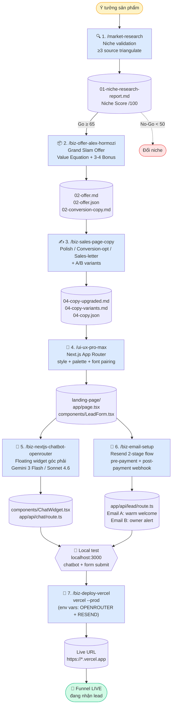

# BIZ.MKT.OS — Pipeline đóng gói sản phẩm số từ ý tưởng → khách hàng nhận email

> **Một "agent" gồm 7 skill chuyên dụng**, chạy tuần tự để biến **1 ý tưởng sản phẩm** thành **1 sales funnel hoàn chỉnh** đang nhận lead thật: research thị trường → đóng gói offer → nâng cấp copy → build landing page Next.js → deploy live trên Vercel → cài AI chatbot tư vấn 24/7 → wire email auto-responder.

Hệ thống được thiết kế cho **thị trường Việt Nam**: tiếng Việt thuần (xưng anh/chị), giá VND charm pricing, mobile-first traffic, voice Hoàng nếu có video.

---

## Mục lục

- [Triết lý vận hành](#triết-lý-vận-hành)
- [Sơ đồ pipeline](#sơ-đồ-pipeline)
- [Naming convention output](#naming-convention-output)
- [7 bước chi tiết](#7-bước-chi-tiết)
  - [Bước 1 — Market Research](#bước-1--market-research-marketresearch)
  - [Bước 2 — Đóng gói Offer](#bước-2--đóng-gói-offer-bizofferalexhormozi)
  - [Bước 3 — Nâng cấp Copy](#bước-3--nâng-cấp-copy-bizsalespagecopy)
  - [Bước 4 — Build Landing Page](#bước-4--build-landing-page-uiuxpromax)
  - [Bước 5 — Cài Chatbot](#bước-5--cài-chatbot-biznextjschatbotopenrouter)
  - [Bước 6 — Setup Email Auto-Responder](#bước-6--setup-email-auto-responder-bizemailsetup)
  - [Bước 7 — Deploy Vercel](#bước-7--deploy-vercel-bizdeployvercel)
- [Checklist Go-Live](#checklist-go-live)
- [Skills đã bị deprecated](#skills-đã-bị-deprecated)
- [FAQ vận hành](#faq-vận-hành)

---

## Triết lý vận hành

1. **Một skill một việc** — mỗi bước là 1 slash command đơn nhiệm, output của bước trước là input của bước sau. Không monolith.
2. **Artifact-first** — mỗi bước ghi ra file có cấu trúc (`.md` để người đọc, `.json` để pipeline downstream parse). Không có file = bước chưa hoàn thành.
3. **Checkpoint con người** — sau mỗi bước critical (offer, copy, landing page) **user duyệt trước** rồi mới chạy bước kế. Skill không auto-chain.
4. **Resume an toàn** — pipeline có thể bắt đầu/dừng/tiếp ở bất kỳ bước nào miễn artifact đầu vào có đủ. Đã có `02-offer.json` → nhảy thẳng vào bước 3.
5. **Mobile-first VN** — mọi landing page bắt buộc form đăng ký (tên/SĐT/email) + responsive web+tablet+mobile.

---

## Sơ đồ pipeline



---

## Naming convention output

Mỗi project nằm trong `output/<slug>/` với prefix số thứ tự bước:

```
output/<slug>/
├── 01-niche-research-report.md      # Bước 1
├── 02-offer.md                      # Bước 2 (human-readable)
├── 02-offer.json                    # Bước 2 (machine-readable, downstream input)
├── 02-conversion-copy.md            # Bước 2 (hero/CTA paste-ready)
├── 04-copy-upgraded.md              # Bước 3 (copy mới)
├── 04-copy-variants.md              # Bước 3 (A/B test bank)
├── 04-copy-changes.md               # Bước 3 (diff Trước/Sau)
├── 04-copy.json                     # Bước 3 (structured)
└── landing-page/                    # Bước 4 → 7 (Next.js project)
    ├── app/page.tsx
    ├── app/api/chat/route.ts        # Bước 5
    ├── app/api/lead/route.ts        # Bước 6
    └── components/
        ├── LeadForm.tsx             # Bước 4
        └── ChatWidget.tsx           # Bước 5
```

> **Lưu ý**: `03-*` bị bỏ trống cố ý — bước 3 cũ là `biz-sales-page-layout` (wireframe markdown) đã **deprecated 2026-05-14**. Pipeline mới đi thẳng từ `02-offer.json` → `ui-ux-pro-max` → `biz-sales-page-copy` (copy polish dùng prefix `04-*`).

---

## 7 bước chi tiết

### Bước 1 — Market Research (`/market-research`)

**Mục đích**: Đo cầu thật của niche trước khi đổ effort. Không phải PESTEL, không phải Porter — đo bằng **keyword volume + marketplace sales + community signal + competitor pricing**.

**Khi nào dùng**:
- "Có nên làm ngách X không?"
- "Niche này có ai làm chưa?"
- "Thị trường có đủ lớn để có lời không?"

**Input cần chuẩn bị**:
- 1 mô tả niche/ý tưởng sản phẩm (1-2 câu)
- Optional: customer persona sơ bộ

**Cách chạy**:
```
/market-research

Niche: Khóa học dạy chủ SME VN cách dùng AI Agent để
tự động hoá marketing social trong 30 ngày
Tier giá dự kiến: 3-7M VND
```

**Output**:
- `01-niche-research-report.md` — Niche Score /100 + evidence ≥3 source mỗi claim quan trọng
- Quyết định **Go / Go-with-MVP / No-Go**

**Decision gate**:
| Score | Hành động |
|-------|-----------|
| ≥75 | Strong Go — chạy bước 2 ngay |
| 65-74 | Solid Go-with-MVP — validate qua landing page trước khi build product |
| 50-64 | Maybe — cần thêm research hoặc đổi angle |
| <50 | No-Go — đổi niche |

> **Reference**: 2 case study đã chạy → `memory/project_ai-agent-personal-brand-course.md` (71/100), `memory/project_ai-agent-busy-owner-course.md` (78/100).

---

### Bước 2 — Đóng gói Offer (`/biz-offer-alex-hormozi`)

**Mục đích**: Biến niche đã validate thành **"grand slam offer"** không thể chối từ — theo Alex Hormozi $100M Offers + Value Proposition Design (Osterwalder).

**2 input mode**:
- **Mode B**: User paste sẵn pains + gains + product → skill đóng gói ngay
- **Mode C**: User chỉ có sản phẩm → skill phỏng vấn theo VPD để surface pain/gain trước

**Cách chạy**:
```
/biz-offer-alex-hormozi

Sản phẩm: Khóa học 30 ngày "AI Marketing Agent cho chủ SME"
Đọc context từ: output/<slug>/01-niche-research-report.md
```

**Skill sẽ ra**:
1. Value Equation scoring (4 lever) → xác định lever yếu nhất
2. Core Offer (anchor segment + dream outcome + mechanism)
3. **Bonus stack hybrid** — brainstorm 5-7 bonus candidate có justification value → user pick/chỉnh 3-4 cái
4. Guarantee (conditional / unconditional / anti-guarantee)
5. Urgency (deadline / qty / cohort)
6. Pricing 3-tier decoy structure (VND charm)

**Output**:
- `02-offer.md` — full markdown report tiếng Việt
- `02-offer.json` — structured cho downstream (`ui-ux-pro-max` parse được)
- `02-conversion-copy.md` — headline + subheadline + CTA paste-ready

**Checkpoint user duyệt**: Đọc 3 file, confirm bonus stack + pricing tier trước khi sang bước 3.

---

### Bước 3 — Nâng cấp Copy (`/biz-sales-page-copy`)

**Mục đích**: Biến copy thô từ `02-offer.json` thành **copy chốt đơn cao** với 3 intensity level:

| Level | Khi nào dùng | Output |
|-------|-------------|--------|
| **1. Polish** | Copy đã ổn, chỉ cần punchy hơn | Light edit + power word |
| **2. Conversion-optimized** | Cần rewrite + A/B test | Rewrite 5 block critical + variants hero/CTA |
| **3. Sales-letter** | Ngách cần thuyết phục sâu | Long-form story-driven + P.S. |

**Formula áp dụng tự động**:
- Pain → **PAR** (Problem-Agitate-Resolve)
- Solution → **BAB** (Before-After-Bridge)
- Benefit → **FEP** (Feature-Evidence-Payoff)
- Final CTA → **PVEN** (Problem-Value-Evidence-Now)
- Testimonial → **Star-Chain-Hook**

**Cách chạy**:
```
/biz-sales-page-copy

Đọc: output/<slug>/02-offer.json + 02-conversion-copy.md
Intensity: Conversion-optimized
Focus: hero, pain section, CTA cuối
```

**Output**:
- `04-copy-upgraded.md` — copy mới
- `04-copy-variants.md` — A/B test bank (3 hero + 3 CTA + 3 final-CTA)
- `04-copy-changes.md` — diff Trước/Sau + lý do
- `04-copy.json` — structured cho `ui-ux-pro-max`

---

### Bước 4 — Build Landing Page (`/ui-ux-pro-max`)

**Mục đích**: Build Next.js App Router landing page **production-ready** từ `02-offer.json` + `04-copy.json`. Không phải Tailwind defaults — phải có design language nhất quán (style + palette + font pairing).

**Skill cung cấp**:
- 67 styles (glassmorphism, claymorphism, minimalism, brutalism, neumorphism, bento grid…)
- 96 palettes
- 57 font pairings
- 25 chart types
- 13 stacks (React/Next/Vue/Svelte/SwiftUI/RN/Flutter)
- shadcn/ui MCP integration

**Hard requirement (per project memory)**:
- ✅ Form đăng ký với 3 field: **tên / SĐT / email**
- ✅ Responsive: web + tablet + mobile (mobile-first)
- ✅ Component `LeadForm.tsx` chuẩn bị sẵn cho bước 7 wire vào Resend API

**Cách chạy**:
```
/ui-ux-pro-max

Đọc: output/<slug>/02-offer.json + 04-copy.json
Style preference: editorial minimalism + claude-orange accent
Output dir: output/<slug>/landing-page/
Stack: Next.js 14 App Router + TypeScript + Tailwind + shadcn/ui
```

**Output**:
```
output/<slug>/landing-page/
├── app/
│   ├── page.tsx          ← Landing page chính
│   ├── layout.tsx
│   └── globals.css
├── components/
│   ├── LeadForm.tsx      ← Form tên/SĐT/email (placeholder action)
│   ├── Hero.tsx
│   ├── Bonus.tsx
│   ├── Pricing.tsx
│   └── FAQ.tsx
├── tailwind.config.ts
├── package.json
└── next.config.js
```

**Test local trước khi deploy**:
```bash
cd output/<slug>/landing-page
npm install
npm run dev
# mở http://localhost:3000 — kiểm mobile responsive
```

---

### Bước 5 — Cài Chatbot (`/biz-nextjs-chatbot-openrouter`)

**Mục đích**: Thêm **floating AI chatbot widget góc dưới phải** vào landing page (làm trong **local**, chưa deploy) — trả lời khách hàng 24/7 dùng knowledge base từ offer + FAQ.

**Skill tự**:
1. Detect số project Next.js trong workspace → hỏi user chọn nếu >1
2. Detect TypeScript/JS, App Router/Pages Router, Tailwind/CSS module
3. Cài OpenRouter SDK + tạo `app/api/chat/route.ts` streaming endpoint
4. Tạo `components/ChatWidget.tsx` floating widget responsive (web/tablet/mobile)
5. Inject knowledge base từ `02-offer.json` + FAQ
6. Tạo `.env.local` với `OPENROUTER_API_KEY` + hướng dẫn lấy key

**Model mặc định**:
- `google/gemini-3-flash-preview` (rẻ, nhanh — recommend cho support bot)
- Hoặc `anthropic/claude-sonnet-4-6` (chất lượng cao hơn — recommend khi cần persuasion)

**Cách chạy**:
```
/biz-nextjs-chatbot-openrouter

Project dir: output/<slug>/landing-page
Knowledge base: 02-offer.json + 02-conversion-copy.md
Tone: tư vấn tự nhiên, xưng anh/chị, không pushy
Goal: trả lời FAQ + dẫn user về form đăng ký
```

**Output**:
- `app/api/chat/route.ts` — streaming endpoint
- `components/ChatWidget.tsx` — widget UI
- `.env.local` updated với `OPENROUTER_API_KEY=`

**Local test**: `npm run dev` → mở `localhost:3000` → click widget góc phải, hỏi 3 câu mẫu trước khi sang bước 6.

---

### Bước 6 — Setup Email Auto-Responder (`/biz-email-setup`)

**Mục đích**: Wire form đăng ký (bước 4) lên **Resend API** để tự động gửi email khi có lead mới — vẫn làm trong **local**, deploy 1 lần ở bước 7. **2-stage flow** (per project memory `feedback_email-autoresponder-2-stage-flow.md`):

| Stage | Trigger | Email gửi | Tone |
|-------|---------|-----------|------|
| **P3 — Pre-payment** | User submit form (tên/SĐT/email) | **Email A** (slim) — confirm + payment link/booking + reminder; **Email B** (owner alert) | Warm welcome, không overwhelm |
| **P5 — Post-payment** | Webhook payment success | **Email A** (full) — onboarding + full deliverables + 1 onboarding question | Full deliverables |

**Skill tự**:
1. Cài Resend SDK + tạo `app/api/lead/route.ts` (App Router) hoặc `pages/api/lead.ts` (Pages Router)
2. Đọc context từ `02-offer.json` + `04-copy.json` (hoặc đọc trực tiếp `app/page.tsx`)
3. **Draft 2 email** (A: cho lead, B: alert cho owner) → show preview HTML
4. **Show draft cho user duyệt** và chỉnh sửa trước khi wire vào code
5. Wire `LeadForm.tsx` lên endpoint với validation
6. Hướng dẫn SPF/DKIM domain verification cho deliverability

**Cách chạy**:
```
/biz-email-setup

Project dir: output/<slug>/landing-page
Offer context: 02-offer.json
Offer type: course (delivery: 30-day cohort + template pack)
Owner email: hoang.tran@prediction3d.com
Sender domain: prediction3d.com (cần verify SPF/DKIM)
```

**Output**:
- `app/api/lead/route.ts` — endpoint nhận form
- Email A template (HTML) + Email B template
- `.env.local` updated: `RESEND_API_KEY=`, `RESEND_FROM=`, `OWNER_EMAIL=`
- Test instructions: curl mock submit + check inbox

**Local test**:
```bash
cd output/<slug>/landing-page
npm run dev
# mở localhost:3000 → submit form → check Email A (lead) + Email B (owner)
```

---

### Bước 7 — Deploy Vercel (`/biz-deploy-vercel`)

**Mục đích**: Bước cuối cùng — đưa landing page **đã có chatbot + email wired + tested local** lên live URL production. Deploy 1 phát, không phải re-deploy nhiều lần.

**Skill tự**:
1. Check Vercel CLI / Vercel MCP đã cài → install nếu chưa
2. Hướng dẫn `vercel login` (nếu chưa auth)
3. Detect framework (Next.js / Vite / CRA / static)
4. Auto-generate `vercel.json` nếu cần
5. **Push env vars** từ `.env.local` lên Vercel (`OPENROUTER_API_KEY`, `RESEND_API_KEY`, `RESEND_FROM`, `OWNER_EMAIL`)
6. Chạy `vercel --prod`
7. Trả về **Live URL + Inspect URL + hướng dẫn custom domain**

**Cách chạy**:
```
/biz-deploy-vercel

Project dir: output/<slug>/landing-page
Project name: ai-marketing-agent-30-ngay
Env vars: OPENROUTER_API_KEY, RESEND_API_KEY, RESEND_FROM, OWNER_EMAIL
```

**Output**:
- Live URL dạng `https://<project>.vercel.app`
- Inspect URL để xem build log
- (Optional) Custom domain setup guide

> ✅ **Vì sao deploy cuối**: Tránh re-deploy 2-3 lần (deploy → cài chatbot → re-deploy → cài email → re-deploy). Local-first → deploy 1 phát sạch sẽ.

---

## Checklist Go-Live

Trước khi share landing page cho audience thật, run-through checklist:

- [ ] **Niche Score ≥ 65** từ bước 1 (evidence ≥3 source mỗi claim)
- [ ] `02-offer.json` có đủ anchor + core + bonus (3-4) + guarantee + urgency + pricing 3-tier
- [ ] Copy đã qua `/biz-sales-page-copy` ít nhất Level 1 (Polish)
- [ ] Landing page test ở 3 viewport: 375px (mobile), 768px (tablet), 1440px (desktop) — **làm trên `localhost:3000` trước**
- [ ] Form `LeadForm.tsx` validate: tên ≥ 2 ký tự, SĐT VN regex `^(0|\+84)[0-9]{9}$`, email valid
- [ ] Chatbot widget local: hiện ở góc phải-dưới, test 3 câu hỏi mẫu trả lời đúng
- [ ] Submit form local → nhận **Email A** trong inbox (không vào spam) + owner nhận **Email B**
- [ ] **Sau khi local OK** → deploy bước 7
- [ ] Live URL Vercel reachable (HTTPS, no 404, no console error)
- [ ] Env vars trên Vercel có đủ: `OPENROUTER_API_KEY`, `RESEND_API_KEY`, `RESEND_FROM`, `OWNER_EMAIL`
- [ ] Re-test chatbot + form submit trên live URL (không phải localhost) — confirm production hoạt động
- [ ] Domain verify SPF + DKIM passed (check qua `dig` hoặc Resend dashboard)
- [ ] Mobile: chatbot widget không che form CTA, email link mở được trên iOS Mail + Gmail app

---

## Skills đã bị deprecated

| Skill | Status | Lý do | Thay thế bằng |
|-------|--------|-------|---------------|
| `/biz-sales-page-layout` | ⚠️ DEPRECATED 2026-05-14 | Wireframe markdown trung gian không tạo giá trị — `ui-ux-pro-max` đọc `02-offer.json` ra Next.js production luôn | Đi thẳng `02-offer.json` → `/ui-ux-pro-max` |

> Chỉ dùng `/biz-sales-page-layout` khi user **explicitly** yêu cầu wireframe markdown để review/print/share trước khi build code (rare).

---

## FAQ vận hành

**Q: Có thể skip bước nào không?**
- Skip bước 1 nếu đã có niche validated từ trước (paste sẵn pain/gain vào bước 2).
- Skip bước 3 nếu copy từ bước 2 đã đủ chất lượng cho MVP — quay lại upgrade sau khi có data conversion.
- **Không skip bước 4** — landing page là spine cho mọi bước sau.
- Bước 5 + 6 có thể chạy parallel (chatbot + email là 2 file độc lập), nhưng phải xong cả 2 + test local OK trước khi sang bước 7.
- **Không skip bước 7** — landing page phải live mới đo được demand thật.

**Q: Resume pipeline ở giữa được không?**
- Có. Skill nào cũng đọc artifact đầu vào (`02-offer.json`, `04-copy.json`…) từ disk — miễn file tồn tại đúng path là tiếp được. Đã có `02-offer.json` → vào thẳng bước 3.

**Q: Multi-project parallel?**
- Mỗi project 1 `output/<slug>/` riêng. Có thể chạy 2 niche song song mà không conflict.

**Q: Cần API key gì?**
- `OPENROUTER_API_KEY` (bước 6) — lấy từ openrouter.ai
- `RESEND_API_KEY` (bước 7) — lấy từ resend.com
- Vercel auth (bước 5) — `vercel login` browser-based, không cần key

**Q: Estimated time end-to-end?**
- Bước 1: 15-30 phút (skill chạy + user đọc report)
- Bước 2: 20-40 phút (skill phỏng vấn nếu Mode C)
- Bước 3: 10-20 phút
- Bước 4: 30-60 phút (build + local test)
- Bước 5: 15-25 phút (chatbot widget)
- Bước 6: 20-30 phút (email + user duyệt draft)
- Bước 7: 5-10 phút (deploy 1 phát cuối)
- **Total: ~2-4 giờ** cho 1 funnel hoàn chỉnh từ ý tưởng → live nhận lead.

---

## Tham chiếu file thực tế (case study)

Project `ai-agent-marketing-busy-owner` đã chạy đầy đủ pipeline — xem `output/ai-agent-marketing-busy-owner/` để tham chiếu structure thật.

- [01-niche-research-report.md](output/ai-agent-marketing-busy-owner/01-niche-research-report.md) — Niche Score 78/100 Solid Go
- [02-offer.json](output/ai-agent-marketing-busy-owner/02-offer.json) — structured offer cho downstream
- [02-offer.md](output/ai-agent-marketing-busy-owner/02-offer.md) — human-readable offer report
- [04-copy-upgraded.md](output/ai-agent-marketing-busy-owner/04-copy-upgraded.md) — copy đã polish
- [landing-page/](output/ai-agent-marketing-busy-owner/landing-page/) — Next.js project
- [landing-page/components/LeadForm.tsx](output/ai-agent-marketing-busy-owner/landing-page/components/LeadForm.tsx) — form 3 field tên/SĐT/email
