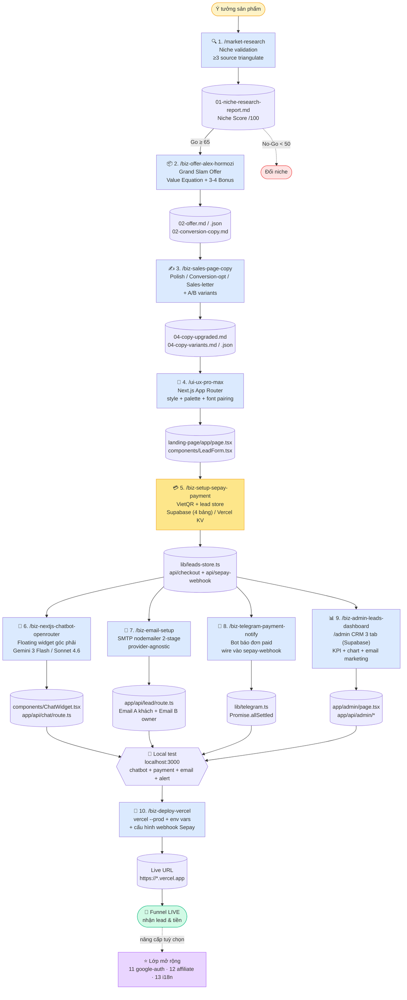
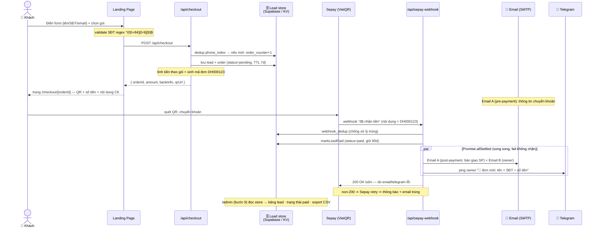
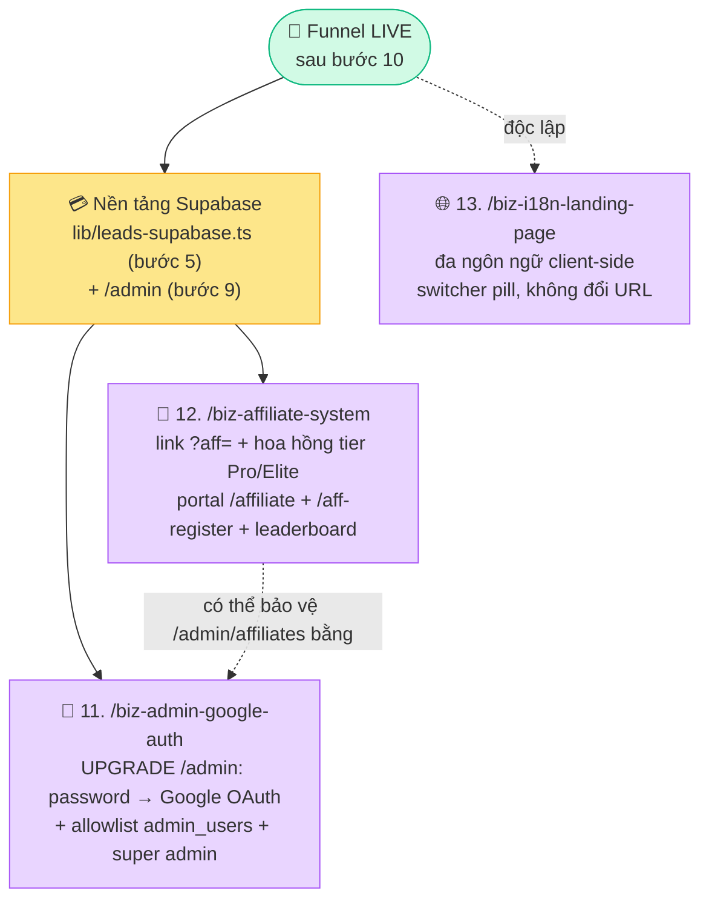

# BIZ.MKT.OS — Pipeline đóng gói sản phẩm số từ ý tưởng → khách hàng nhận email

> **Một "agent" gồm 13 skill chuyên dụng** (+ 1 deprecated), chạy tuần tự để biến **1 ý tưởng sản phẩm** thành **1 sales funnel hoàn chỉnh** đang nhận lead & tiền thật: research thị trường → đóng gói offer → nâng cấp copy → build landing page Next.js → thanh toán tự động VietQR → chatbot AI 24/7 → email auto-responder → báo đơn Telegram → admin CRM dashboard → deploy live. Sau đó nâng cấp tuỳ chọn: đăng nhập Google cho admin, hệ thống affiliate, đa ngôn ngữ.

Hệ thống thiết kế cho **thị trường Việt Nam**: tiếng Việt thuần (xưng anh/chị), giá VND charm pricing, mobile-first traffic.

---

## Mục lục

- [Triết lý vận hành](#triết-lý-vận-hành)
- [Bản đồ skill (13 + 1)](#bản-đồ-skill-13--1)
- [Sơ đồ pipeline (build-time)](#sơ-đồ-pipeline-build-time)
- [Sơ đồ runtime thanh toán → webhook](#sơ-đồ-runtime-thanh-toán--webhook)
- [Naming convention output](#naming-convention-output)
- [10 bước core chi tiết](#10-bước-core-chi-tiết)
- [Lớp mở rộng (post-funnel)](#lớp-mở-rộng-post-funnel)
  - [Sơ đồ phụ thuộc lớp mở rộng](#sơ-đồ-phụ-thuộc-lớp-mở-rộng)
  - [11 — Google Auth cho /admin](#11--google-auth-cho-admin-biz-admin-google-auth)
  - [12 — Hệ thống Affiliate](#12--hệ-thống-affiliate-biz-affiliate-system)
  - [13 — Đa ngôn ngữ Landing Page](#13--đa-ngôn-ngữ-landing-page-biz-i18n-landing-page)
- [Hướng dẫn Supabase & Vercel CLI](#hướng-dẫn-supabase--vercel-cli)
- [Checklist Go-Live](#checklist-go-live)
- [Skills đã deprecated](#skills-đã-deprecated)
- [FAQ vận hành](#faq-vận-hành)

---

## Triết lý vận hành

1. **Một skill một việc** — mỗi bước là 1 slash command đơn nhiệm, output của bước trước là input của bước sau. Không monolith.
2. **Artifact-first** — mỗi bước ghi ra file có cấu trúc (`.md` để người đọc, `.json` để pipeline downstream parse). Không có file = bước chưa hoàn thành.
3. **Checkpoint con người** — sau mỗi bước critical (offer, copy, landing page, email draft) **user duyệt trước** rồi mới chạy bước kế. Skill không auto-chain.
4. **Resume an toàn** — pipeline có thể bắt đầu/dừng/tiếp ở bất kỳ bước nào miễn artifact đầu vào có đủ. Đã có `02-offer.json` → nhảy thẳng vào bước 3.
5. **Local-first → deploy 1 phát** — build + chatbot + email + payment + admin đều làm trên `localhost:3000`, test xong mới `/biz-deploy-vercel` một lần cho sạch.
6. **Mobile-first VN** — mọi landing page bắt buộc form đăng ký (tên/SĐT/email, regex `^(0|\+84)[0-9]{9}$`) + responsive web+tablet+mobile.

---

## Bản đồ skill (13 + 1)

| # | Skill | Vai trò | Phụ thuộc trước đó |
|---|-------|---------|--------------------|
| 1 | `/market-research` | Validate cầu thật, Niche Score /100 | — |
| 2 | `/biz-offer-alex-hormozi` | Grand Slam Offer + `offer.json` | (1) |
| 3 | `/biz-sales-page-copy` | Nâng cấp copy chốt đơn + A/B variants | (2) |
| 4 | `/ui-ux-pro-max` | Build landing page Next.js production | (2)(3) |
| 5 | `/biz-setup-sepay-payment` | VietQR + lead store (**Supabase**/KV) — NỀN TẢNG | (4) |
| 6 | `/biz-nextjs-chatbot-openrouter` | Chatbot AI floating widget | (4) |
| 7 | `/biz-email-setup` | Email auto-responder **SMTP (nodemailer)** | (4), wire vào (5) |
| 8 | `/biz-telegram-payment-notify` | Báo đơn paid qua Telegram | (5) |
| 9 | `/biz-admin-leads-dashboard` | `/admin` CRM (chỉ Supabase) | (5)+(7) |
| 10 | `/biz-deploy-vercel` | Deploy production live | tất cả |
| 11 | `/biz-admin-google-auth` ⭐ | Upgrade `/admin`: Google OAuth + allowlist | (9) |
| 12 | `/biz-affiliate-system` ⭐ | Affiliate `?aff=` + hoa hồng + portal + tự đăng ký + leaderboard + email đối tác | (5 Supabase) |
| 13 | `/biz-i18n-landing-page` ⭐ | Đa ngôn ngữ landing page | (4) |
| — | `/biz-sales-page-layout` | ⚠️ DEPRECATED 2026-05-14 | — |

> Bước **1–10** là pipeline core (dựng funnel nhận lead & tiền). Bước **11–13** là lớp mở rộng tuỳ chọn (⭐), chạy sau khi funnel đã có payment + admin.

---

## Sơ đồ pipeline (build-time)

Luồng **dựng funnel** — 10 skill core chạy tuần tự khi build 1 sản phẩm mới (ý tưởng → live):



---

## Sơ đồ runtime thanh toán → webhook

Sơ đồ trên là **build-time** (dựng funnel 1 lần). Sơ đồ dưới là **runtime** — điều gì xảy ra **mỗi khi một khách thật mua hàng**, từ lúc bấm nút tới lúc owner nhận thông báo. Đây là lúc các skill bước 5 (Sepay) + 7 (Email) + 8 (Telegram) + 9 (Admin) phối hợp (chi tiết thuật toán + vòng đời `status`: [so-do-thuat-toan-landing-page-supabase.md](so-do-thuat-toan-landing-page-supabase.md)):



> 🔑 **Bất biến quan trọng**: webhook **luôn trả 200** kể cả khi email/Telegram fail — vì Sepay sẽ **retry** nếu nhận non-200, gây thông báo + email trùng. Side-effect chạy qua `Promise.allSettled` để một cái lỗi không kéo cả response xuống. Vòng đời `status`: `pending` (7 ngày) → `paid` (90 ngày) → `expired` (pg_cron tự dọn).

---

## Naming convention output

Mỗi project nằm trong `output/<slug>/` với prefix số thứ tự bước:

```
output/<slug>/
├── 01-niche-research-report.md      # Bước 1
├── 02-offer.md                      # Bước 2 (human-readable)
├── 02-offer.json                    # Bước 2 (machine-readable, downstream input)
├── 02-conversion-copy.md            # Bước 2 (hero/CTA paste-ready)
├── 04-copy-upgraded.md              # Bước 3 (copy mới)
├── 04-copy-variants.md              # Bước 3 (A/B test bank)
├── 04-copy-changes.md               # Bước 3 (diff Trước/Sau)
├── 04-copy.json                     # Bước 3 (structured)
└── landing-page/                    # Bước 4 → 13 (Next.js project)
    ├── app/
    │   ├── page.tsx                 # Trang sales chính
    │   ├── admin/
    │   │   ├── page.tsx             # Bước 9: Dashboard CRM
    │   │   └── affiliates/page.tsx  # Bước 12: Quản trị affiliate
    │   ├── affiliate/page.tsx       # Bước 12: Portal đối tác
    │   ├── checkout/[orderId]/page.tsx # Bước 5: Trang VietQR
    │   ├── i18n/                     # Bước 13: Context + dictionaries
    │   └── api/
    │       ├── chat/route.ts         # Bước 6: chatbot OpenRouter
    │       ├── lead/route.ts         # Bước 7: gửi email SMTP
    │       ├── checkout/route.ts     # Bước 5: khởi tạo đơn
    │       ├── sepay-webhook/route.ts # Bước 5: nhận webhook
    │       ├── affiliate/route.ts    # Bước 12: portal data
    │       └── admin/                # Bước 9 + 11: leads / dashboard / campaigns / me / admin-users
    ├── components/
    │   ├── LeadForm.tsx              # Bước 4
    │   ├── ChatWidget.tsx            # Bước 6
    │   ├── AdminUsersTab.tsx         # Bước 11
    │   └── AffiliateTracker.tsx      # Bước 12
    └── lib/
        ├── leads-store.ts           # Bước 5: wrapper provider-agnostic
        ├── leads-supabase.ts        # Bước 5: impl Supabase (mặc định)
        ├── mailer.ts                # Bước 7/9: nodemailer transporter
        ├── telegram.ts              # Bước 8
        ├── admin-auth.ts            # Bước 11: requireAdmin (Google OAuth)
        └── affiliate.ts             # Bước 12
```

> **Lưu ý**: `03-*` bị bỏ trống cố ý — bước 3 cũ là `biz-sales-page-layout` (wireframe markdown) đã **deprecated 2026-05-14**. Pipeline mới đi thẳng `02-offer.json` → `ui-ux-pro-max` → `biz-sales-page-copy` (copy polish prefix `04-*`).

---

## 10 bước core chi tiết

### Bước 1 — Market Research (`/market-research`)

**Mục đích**: Đo cầu thật của niche trước khi đổ effort — bằng **keyword volume + marketplace sales (Shopee/Unica/Edumall/Gitiho) + community signal (FB group, TikTok hashtag, Zalo OA) + competitor pricing + unit economics**. Không phải PESTEL/Porter.

**Output**: `01-niche-research-report.md` — Niche Score /100 (7 dimension, evidence ≥3 source mỗi claim) + quyết định **Go / Go-with-MVP / No-Go**.

| Score | Hành động |
|-------|-----------|
| ≥75 | Strong Go — chạy bước 2 ngay |
| 65–74 | Solid Go-with-MVP — validate qua landing page trước khi build product |
| 50–64 | Maybe — cần thêm research hoặc đổi angle |
| <50 | No-Go — đổi niche |

---

### Bước 2 — Đóng gói Offer (`/biz-offer-alex-hormozi`)

**Mục đích**: Biến niche đã validate thành **grand slam offer** không thể chối từ — Alex Hormozi $100M Offers + Value Proposition Design (Osterwalder).

- **Mode B**: user paste sẵn pains + gains + product → đóng gói ngay.
- **Mode C**: user chỉ có sản phẩm → skill phỏng vấn theo VPD để surface pain/gain trước.

Skill ra: Value Equation scoring (4 lever) → Core Offer → **Bonus stack hybrid** (brainstorm 5–7 candidate, user pick 3–4) → Guarantee → Urgency → Pricing 3-tier decoy (VND charm).

**Output**: `02-offer.md` + `02-offer.json` (downstream) + `02-conversion-copy.md` (headline/sub/CTA paste-ready).

---

### Bước 3 — Nâng cấp Copy (`/biz-sales-page-copy`)

**Mục đích**: Biến copy thô từ `02-offer.json` thành **copy chốt đơn cao** — 3 intensity level:

| Level | Khi nào | Output |
|-------|---------|--------|
| **1. Polish** | Copy đã ổn, cần punchy hơn | Light edit + power word |
| **2. Conversion-optimized** | Cần rewrite + A/B test | Rewrite 5 block critical + variants hero/CTA |
| **3. Sales-letter** | Ngách cần thuyết phục sâu | Long-form story-driven + P.S. |

Formula tự áp dụng: Pain → **PAR**, Solution → **BAB**, Benefit → **FEP**, Final CTA → **PVEN**, Testimonial → **Star-Chain-Hook**.

**Output**: `04-copy-upgraded.md` + `04-copy-variants.md` (3 hero + 3 CTA + 3 final-CTA) + `04-copy-changes.md` (diff) + `04-copy.json`.

---

### Bước 4 — Build Landing Page (`/ui-ux-pro-max`)

**Mục đích**: Build Next.js App Router landing page **production-ready** từ `02-offer.json` + `04-copy.json`. Design language nhất quán (67 styles · 96 palettes · 57 font pairings · shadcn/ui MCP), không phải Tailwind defaults.

**Hard requirement**: form 3 field **tên / SĐT / email** · responsive mobile-first · `LeadForm.tsx` sẵn sàng wire sang checkout.

**Test local**: `cd output/<slug>/landing-page && npm install && npm run dev` → `localhost:3000`.

---

### Bước 5 — Thanh toán VietQR (`/biz-setup-sepay-payment`) — NỀN TẢNG

**Mục đích**: Hạ tầng thanh toán tự động VietQR qua **Sepay.vn** + lead store. Đây là **nền tảng** cho bước 7/8/9/12.

- Phase 0: **HỎI user chọn lead store** — Vercel KV hoặc **Supabase** (default, free tier rộng hơn ~50× + có SQL + admin UI).
- Supabase: 4 bảng `leads / phone_index / order_counter / webhook_dedup` (pg_cron TTL cleanup, RLS deny-all) + Vercel Cron ping `/api/health` mỗi 6 ngày chống auto-pause.
- `lib/leads-store.ts` (wrapper provider-agnostic) → đổi provider = sửa 1 dòng re-export.
- `order_id` định dạng `DH{6-digit}`. QR qua `https://qr.sepay.vn/img?...` (chỉ image URL, không cần backend).
- `app/api/sepay-webhook/route.ts`: Apikey auth timing-safe + dedup theo `payload.id` + multi-strategy matching (content-orderid → content-phone → amount-timestamp) + side-effect placeholder sẵn cho email/telegram.

**Output**: `lib/leads-store.ts` + `lib/leads-{supabase|kv}.ts` + `api/checkout` + `api/sepay-webhook` + trang `/checkout/[orderId]`.

---

### Bước 6 — Chatbot AI (`/biz-nextjs-chatbot-openrouter`)

**Mục đích**: Floating widget góc dưới phải, trả lời khách 24/7 qua **OpenRouter** (mặc định `google/gemini-3-flash-preview`, đổi được sang `anthropic/claude-sonnet-4.6`), streaming, **render markdown** (react-markdown + remark-gfm), knowledge base từ offer + FAQ. Tự **extract + lưu lead** (tên/SĐT/email) vào KV/Upstash namespace `chat-lead:{phone}` (dedupe theo SĐT, TTL 90 ngày, fire-and-forget).

**Output**: `app/api/chat/route.ts` + `components/ChatWidget.tsx` + `.env.local` (`OPENROUTER_API_KEY`).

---

### Bước 7 — Email Auto-Responder (`/biz-email-setup`)

**Mục đích**: Wire form lên **SMTP qua `nodemailer`** (KHÔNG cố định provider) — gửi email tự động khi có lead. 2-stage:

| Stage | Trigger | Email |
|-------|---------|-------|
| Pre-payment | User submit form | Email A (warm welcome + payment link) + Email B (owner alert) |
| Post-payment | Sepay webhook success | Email A (onboarding + bàn giao sản phẩm số) |

- Hỏi user chọn provider: Gmail/Workspace, Resend SMTP, SendGrid, Mailgun, Brevo, Zoho, hoặc SMTP custom hosting VN.
- **Draft 2 email → user duyệt** trước khi wire vào code. SPF/DKIM verification guide theo provider.

**Output**: `app/api/lead/route.ts` + email templates + `.env.local` (`SMTP_HOST/SMTP_PORT/SMTP_USER/SMTP_PASS/MAIL_FROM/OWNER_EMAIL`).

---

### Bước 8 — Thông báo Telegram (`/biz-telegram-payment-notify`)

**Mục đích**: Bot Telegram báo realtime khi khách chuyển khoản thành công. Wire **cùng chỗ** với email trong `/api/sepay-webhook` qua `Promise.allSettled` — Telegram fail KHÔNG block 200 trả Sepay.

- Guide 3 bước tạo bot qua @BotFather + lấy `chat_id` (@userinfobot cho 1-1, `/getUpdates` cho group).
- Message tiếng Việt: tên + SĐT + email + amount (`499.000đ`) + sản phẩm + timestamp giờ VN.

**Output**: `lib/telegram.ts` + `.env.local` (`TELEGRAM_BOT_TOKEN`, `TELEGRAM_CHAT_ID`).

---

### Bước 9 — Admin Dashboard (`/biz-admin-leads-dashboard`)

**Mục đích**: Trang `/admin` CRM-style 1CRM-inspired (**chỉ Supabase**, KHÔNG còn KV). Sidebar 3 tab + popup nhập mã đăng nhập (mặc định `123456`).

- **Tổng quan**: 4 KPI card (Tổng leads / Đã thanh toán / Tỷ lệ chuyển đổi / Doanh thu) có delta vs kỳ trước, line chart + donut (`recharts`), period 7d/30d/90d.
- **Khách hàng**: bảng leads + search + filter trạng thái/ngày + CSV export.
- **Email marketing**: soạn chiến dịch (text hoặc HTML, placeholder `{{name}}`, audience all/paid/pending/last_days) → **Xem trước** modal iframe → gửi bulk qua SMTP (**reuse `nodemailer` của bước 7**, throttle 200ms) → log per-recipient + bảng lịch sử.

**Tiền đề**: phải có `lib/leads-supabase.ts` (bước 5 chọn Supabase) + SMTP env (bước 7).

**Output**: 8 file + migration `campaigns`/`campaign_sends` + `ADMIN_PASSWORD` + npm dep `recharts`.

---

### Bước 10 — Deploy Production (`/biz-deploy-vercel`)

**Mục đích**: Bước cuối — đưa landing page đã test local lên live URL. Tự detect framework, auto-gen `vercel.json`, **push env vars** lên Vercel, chạy `vercel --prod`.

**Sau deploy**: cấu hình **Webhook URL trên Sepay Dashboard** trỏ tới `https://yourdomain.com/api/sepay-webhook` + chọn xác thực `API Key`.

**Output**: Live URL `https://<project>.vercel.app` + Inspect URL + (optional) custom domain guide.

---

## Lớp mở rộng (post-funnel)

Bước 1–10 dựng funnel **nhận lead & tiền**. 3 skill mở rộng (⭐) nâng cấp funnel khi đã chạy ổn — đều yêu cầu **Supabase** (chọn ở bước 5).

### Sơ đồ phụ thuộc lớp mở rộng



### 11 — Google Auth cho /admin (`/biz-admin-google-auth`)

**Vấn đề giải quyết**: `/admin` mặc định 1 password chung (`ADMIN_PASSWORD`) — không phân biệt ai, không thu hồi quyền 1 người. Skill đổi lớp auth sang **Google OAuth (Supabase Auth) + allowlist**: chỉ email trong bảng `admin_users` mới vào được, có **super admin** + tab **Quản trị viên** để thêm/xoá admin ngay trong dashboard.

**Là skill UPGRADE** chạy **sau** bước 9 — không build lại dashboard, chỉ PATCH route `/api/admin/*` (`checkAdminPass` → `requireAdmin`) + `app/admin/page.tsx` (popup → Google gate + `adminFetch`).

**Output**: migration `admin_users` (RLS deny-all + `is_admin_email`) + `lib/admin-auth.ts` + `lib/admin-client.ts` + `lib/admin-users.ts` + `api/admin/me` + `api/admin/admin-users` + `AdminUsersTab.tsx`. Env mới: `NEXT_PUBLIC_SUPABASE_URL`, `NEXT_PUBLIC_SUPABASE_ANON_KEY`.

> Bỏ qua nếu chỉ 1 người dùng `/admin` và muốn giữ password đơn giản.

### 12 — Hệ thống Affiliate (`/biz-affiliate-system`)

**Mục đích**: Đối tác gắn link `?aff=CODE` → skill gán đơn theo **last-touch cookie 30 ngày** → tính hoa hồng theo tier (**Pro 30% / Elite 40%**, chỉnh được) → tạo bản ghi hoa hồng khi đơn paid → theo dõi chi trả (chờ duyệt → đã duyệt → đã trả).

**Output**: 3 bảng Supabase (`affiliates / affiliate_clicks / affiliate_commissions`) + ALTER `leads` thêm `aff_code` + `lib/affiliate.ts` + `AffiliateTracker` + 3 API route + trang quản trị `/admin/affiliates` + portal đối tác `/affiliate` (đăng nhập bằng mã aff + email). Patch 4 file (`leads-supabase.ts`, `api/register`, `api/sepay-webhook`, `layout.tsx`).

**Phase 7 extensions (tuỳ chọn, xem `references/affiliate-extensions.md`)**:
- **Trang đăng ký đối tác công khai** `/aff-register` — tự phục vụ, nhận mã aff + link ngay (không cần admin tạo tay).
- **Bảng xếp hạng** `/api/admin/affiliate-leaderboard` — podium top đối tác theo tuần/tháng/năm.
- **4 loại email cho đối tác** qua `lib/affiliate-mailer.ts`: welcome khi đăng ký · báo có hoa hồng mới khi đơn paid · báo đã chi trả hoa hồng · bulk email cho audience `affiliates`.

**Tiền đề**: Sepay payment + `lib/leads-supabase.ts` (+ SMTP từ bước 7 nếu bật email đối tác). 1 tầng phẳng (không MLM nhiều tầng).

### 13 — Đa ngôn ngữ Landing Page (`/biz-i18n-landing-page`)

**Mục đích**: Biến landing page 1 ngôn ngữ thành đa ngôn ngữ — nút pill chuyển ngôn ngữ góc trên phải, đổi **tức thì không reload, không đổi URL**.

- Phỏng vấn user (AskUserQuestion): chọn ngôn ngữ (Tiếng Việt / English / 中文 / 한국어 / Other) + ngôn ngữ mặc định.
- Quét toàn bộ copy hardcode → dictionary → **tự dịch bản địa hoá** (giữ brand + giá VND + SĐT + URL).
- i18n client-side trong `app/i18n/` (React Context + JSON + localStorage + auto-detect browser), **không thêm dependency**, KHÔNG đụng `app/api` hay `app/admin`.

**Output**: `app/i18n/` + `LanguageProvider` + `LanguageSwitcher` + rewire component dùng hook `useT()`. File `vi.ts` làm source-of-truth type → TS bắt lỗi nếu thiếu key dịch.

> Skill chỉ lo copy **hiển thị trên landing page** — KHÔNG dịch chatbot / email / admin.

---

## Hướng dẫn Supabase & Vercel CLI

### 1. Deploy với Vercel CLI

```bash
npm install -g vercel          # cài CLI (nếu chưa có)
vercel login                   # xác thực qua Google/GitHub/Email
vercel link                    # link dự án tại thư mục landing-page/
# đẩy env vars lên production:
vercel env add OPENROUTER_API_KEY production
vercel env add SMTP_HOST production        # + SMTP_PORT/USER/PASS/MAIL_FROM/OWNER_EMAIL
vercel env add SUPABASE_URL production     # + SUPABASE_SERVICE_ROLE_KEY
vercel env add TELEGRAM_BOT_TOKEN production # + TELEGRAM_CHAT_ID
vercel --prod                  # build + publish → Live URL
```

### 2. Kết nối Supabase (Postgres)

Lấy credentials trong **Supabase Dashboard → Project Settings → API**:
- `NEXT_PUBLIC_SUPABASE_URL` (Project URL) — an toàn ở client.
- `NEXT_PUBLIC_SUPABASE_ANON_KEY` (anon/public) — an toàn ở client.
- `SUPABASE_SERVICE_ROLE_KEY` (service_role) — **CHỈ server-side**, không bao giờ lộ ở client.

`.env.local`:
```env
NEXT_PUBLIC_SUPABASE_URL=https://your-project.supabase.co
NEXT_PUBLIC_SUPABASE_ANON_KEY=your-anon-key
SUPABASE_URL=https://your-project.supabase.co
SUPABASE_SERVICE_ROLE_KEY=your-service-role-key
```

> Migration SQL (4 bảng `leads/phone_index/order_counter/webhook_dedup` + RLS + pg_cron) do `/biz-setup-sepay-payment` tự sinh và hướng dẫn chạy trong SQL Editor — không cần viết tay.

### 3. Cài Supabase MCP Server

Hosted (khuyên dùng) — cấu hình cho Claude Code CLI:
```bash
claude mcp add --scope project --transport http supabase "https://mcp.supabase.com/mcp"
```
Lần đầu agent gọi tool, trình duyệt bật tab đăng nhập Supabase + chọn dự án cấp quyền. (Repo này đã wire sẵn Supabase MCP ở `.mcp.json`.)

---

## Checklist Go-Live

- [ ] **Niche Score ≥ 65** (evidence ≥3 source mỗi claim).
- [ ] `02-offer.json` đủ anchor + core + bonus (3–4) + guarantee + urgency + pricing 3-tier.
- [ ] Copy qua `/biz-sales-page-copy` ít nhất Level 1 (Polish).
- [ ] Landing page test 3 viewport: 375px / 768px / 1440px trên `localhost:3000`.
- [ ] Form `LeadForm.tsx` validate SĐT `^(0|\+84)[0-9]{9}$`, email valid.
- [ ] Bấm đăng ký → sinh `DHxxxxxx` → lưu Supabase → trang `/checkout` hiện QR đúng số tiền + nội dung.
- [ ] Quét QR thử bằng app ngân hàng → đúng STK thụ hưởng + số tiền + nội dung.
- [ ] Chatbot widget local: hiện góc phải, test 3 câu trả lời đúng.
- [ ] Submit form local → nhận **Email A** (không vào spam) + owner nhận **Email B**.
- [ ] **Sau khi local OK** → `/biz-deploy-vercel`.
- [ ] Env vars trên Vercel đủ: `OPENROUTER_API_KEY`, `SMTP_*`, `SUPABASE_*`, `TELEGRAM_*`.
- [ ] Cấu hình Webhook URL trên Sepay Dashboard → `https://yourdomain.com/api/sepay-webhook` + API Key.
- [ ] Test 1 đơn thật 1.000đ: Telegram về <3s + khách nhận Email + `/admin` hiện đơn `paid`.
- [ ] (Nếu dùng) `/biz-admin-google-auth`: đăng nhập Gmail vào được, email ngoài allowlist bị chặn.
- [ ] (Nếu dùng) `/biz-affiliate-system`: link `?aff=` ghi cookie, đơn gán đúng affiliate, hoa hồng tính đúng tier.

---

## Skills đã deprecated

| Skill | Status | Lý do | Thay thế |
|-------|--------|-------|----------|
| `/biz-sales-page-layout` | ⚠️ DEPRECATED 2026-05-14 | Wireframe markdown trung gian không tạo giá trị — `ui-ux-pro-max` đọc `02-offer.json` ra Next.js production luôn | Đi thẳng `02-offer.json` → `/ui-ux-pro-max` |

> Chỉ dùng khi user **explicitly** yêu cầu wireframe markdown để review/print/share trước khi build code (rare).

---

## FAQ vận hành

**Q: Skip bước nào được?**
- Skip 1 nếu đã có niche validated (paste pain/gain vào bước 2).
- Skip 3 nếu copy bước 2 đủ cho MVP — quay lại upgrade sau khi có data conversion.
- **Không skip 4** — landing page là xương sống.
- Bước 6/7/8/9 chạy parallel hoặc skip bớt tuỳ nhu cầu (ví dụ chỉ Telegram, không email). Nhưng test local OK hết rồi mới sang 10.
- **Không skip 5** nếu cần nhận tiền — đây là nền tảng cho 7/8/9/12.
- Bước 11/12/13 hoàn toàn tuỳ chọn, chạy sau khi funnel ổn định.

**Q: Resume pipeline ở giữa được không?**
- Có. Skill nào cũng đọc artifact đầu vào (`02-offer.json`, `04-copy.json`, `lib/leads-supabase.ts`…) từ disk — miễn file tồn tại đúng path là tiếp được.

**Q: Cần API key gì?**
- `OPENROUTER_API_KEY` (bước 6 chatbot) — openrouter.ai
- SMTP credentials (bước 7 email) — tuỳ provider (Gmail/Resend/Brevo/SendGrid/Zoho/custom)
- `SEPAY_WEBHOOK_API_KEY` (bước 5) — my.sepay.vn
- `SUPABASE_URL` + `SUPABASE_SERVICE_ROLE_KEY` (bước 5 Supabase) — Supabase Dashboard
- `TELEGRAM_BOT_TOKEN` + `TELEGRAM_CHAT_ID` (bước 8) — @BotFather
- Vercel auth (bước 10) — `vercel login`, không cần key

**Q: KV hay Supabase?**
- **Supabase** (mặc định, khuyên dùng): free tier rộng hơn ~50×, có SQL + admin UI, **bắt buộc** cho admin dashboard / affiliate / google-auth.
- Vercel KV: chỉ phù hợp funnel tối giản không cần admin/affiliate.

**Q: Multi-project parallel?**
- Mỗi project 1 `output/<slug>/` riêng — chạy nhiều niche song song không conflict.

---

## Tham chiếu

- [so-do-thuat-toan-landing-page-supabase.md](so-do-thuat-toan-landing-page-supabase.md) — thuật toán checkout/webhook + vòng đời `status` chi tiết.
- `.claude/skills/<skill-name>/SKILL.md` — prompt đầy đủ từng skill.
- `CLAUDE.md` / `AGENTS.md` — hướng dẫn cho AI agent khi làm việc trong repo.
