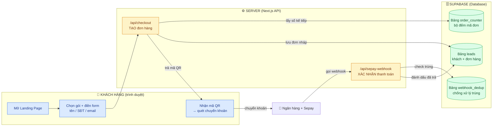
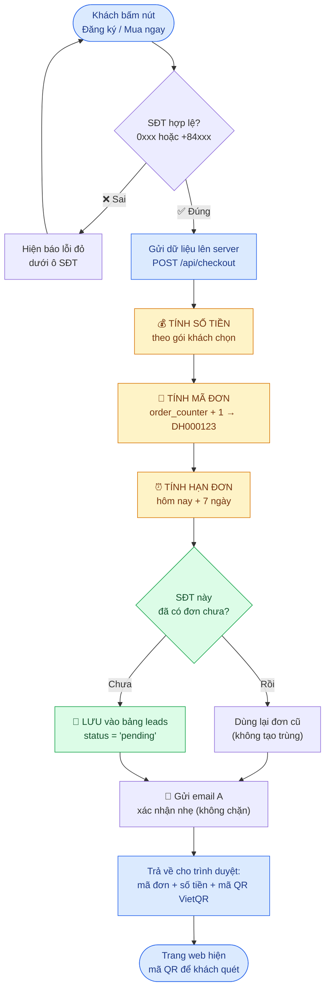
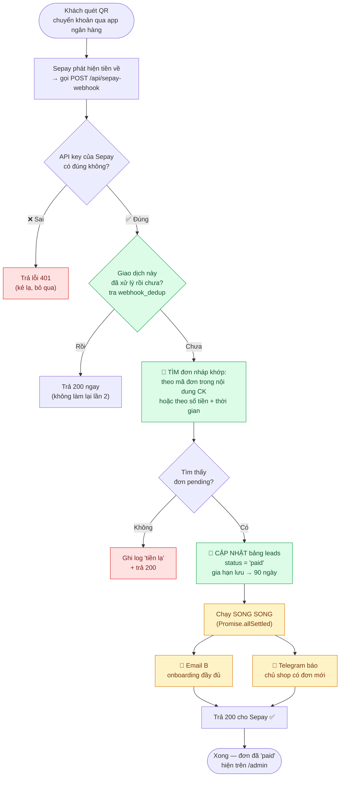
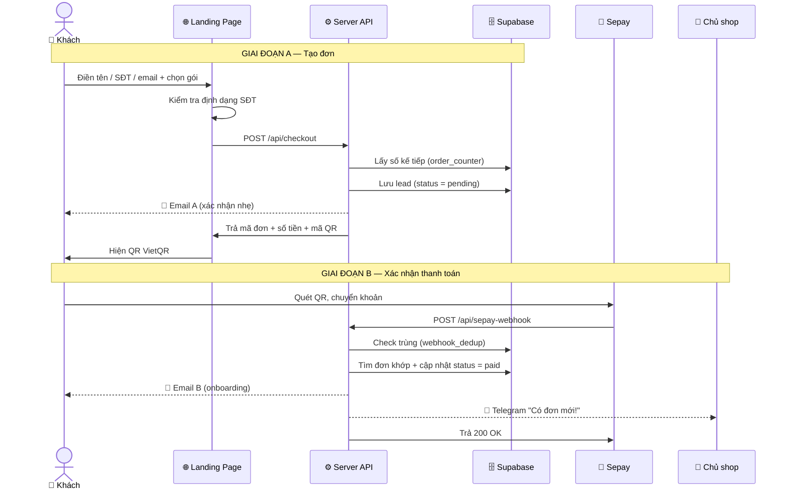
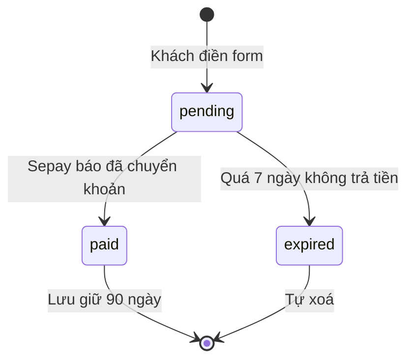

# Sơ đồ thuật toán: Landing Page → Thanh toán → Lưu Supabase

> Tài liệu này giải thích **cách landing page tự động tính đơn hàng, lưu lead, lưu đơn hàng xuống database Supabase** — viết cho người mới học, từ dễ đến khó.

---

## 1. Hiểu nhanh trong 30 giây

Một landing page bán hàng làm 2 việc lớn, lặp đi lặp lại:

1. **Khi khách điền form** → tạo một "đơn hàng nháp" (chưa trả tiền) và lưu xuống database.
2. **Khi khách chuyển khoản xong** → ngân hàng báo về, hệ thống tự đánh dấu đơn đó "đã thanh toán".

Mọi thứ cần nhớ — tên khách, SĐT, email, gói đã chọn, số tiền, mã đơn, trạng thái — đều được **lưu xuống Supabase** (một database online miễn phí). Không lưu trong đầu, không lưu tạm trong trình duyệt.

> 💡 **Quy tắc vàng:** "Nếu chưa ghi xuống database thì coi như chưa xảy ra."

---

## 2. Sơ đồ tổng quan — 3 khu vực

Hệ thống chia làm 3 vùng. Hãy nhìn theo màu:

- 🔵 **Khách hàng** — chỉ nhìn thấy trang web, không thấy database.
- 🟡 **Server** — bộ não, nhận yêu cầu và quyết định.
- 🟢 **Supabase** — bộ nhớ lâu dài, ghi xuống đĩa.

---

## 3. Giai đoạn A — Khách điền form (TẠO đơn hàng)

Đây là lúc "đơn hàng nháp" ra đời. Khách chưa trả tiền, nhưng hệ thống đã ghi nhớ họ.

### "Tính toán tự động" gồm những gì?

| Tính cái gì | Dựa vào đâu | Kết quả ví dụ |
|---|---|---|
| 💰 **Số tiền** | Gói (tier) khách chọn trong offer | `499.000đ` |
| 🔢 **Mã đơn** | Bảng `order_counter` tăng dần | `DH000123` |
| ⏰ **Hạn đơn** | Ngày tạo + 7 ngày (đơn chưa trả) | `expires_at` |
| 🔁 **Chống trùng** | Tra bảng `phone_index` theo SĐT | dùng lại đơn cũ |

> Server **tự làm hết** — khách không phải nhập số tiền hay mã đơn. Khách chỉ điền tên / SĐT / email.

---

## 4. Giai đoạn B — Khách quét QR thanh toán (XÁC NHẬN đơn)

Khách chuyển khoản xong, ngân hàng báo cho **Sepay**, Sepay "gõ cửa" server qua một webhook.

### 3 điều quan trọng ở giai đoạn này

1. **Phải trả về `200` cho Sepay.** Nếu trả lỗi, Sepay tưởng thất bại và **gọi lại nhiều lần** → khách bị spam email/Telegram. Vì vậy có bảng `webhook_dedup` để "nhớ" giao dịch nào đã xử lý.
2. **Email + Telegram chạy song song.** Nếu Telegram lỗi cũng **không được làm hỏng** việc trả `200`. Đó là lý do dùng `Promise.allSettled` (chạy hết, không quan tâm cái nào fail).
3. **Khớp đơn tự động.** Server đối chiếu số tiền + nội dung chuyển khoản (chứa mã đơn `DH000123`) để biết tiền này là của ai.

---

## 5. Sơ đồ trình tự theo thời gian

Cùng một câu chuyện, nhưng nhìn theo "ai nói chuyện với ai, theo thứ tự nào":

---

## 6. Dữ liệu lưu xuống Supabase (4 bảng)

Đây là phần "lưu toàn bộ xuống database". Mỗi bảng có một nhiệm vụ riêng:

| Bảng | Nhiệm vụ | Cột chính |
|---|---|---|
| **leads** | Trái tim hệ thống — mỗi dòng = 1 khách + 1 đơn hàng | `order_id`, `name`, `phone`, `email`, `package`, `amount`, `status`, `created_at`, `paid_at`, `expires_at` |
| **phone_index** | Sổ tra cứu nhanh "SĐT này đã đăng ký chưa" → chống tạo đơn trùng | `phone` → `order_id` |
| **order_counter** | Chỉ 1 dòng duy nhất, giữ con số đếm, tăng dần để sinh `DH000001`, `DH000002`… | `current_value` |
| **webhook_dedup** | Nhớ những giao dịch Sepay đã xử lý → chống xử lý 1 giao dịch 2 lần | `transaction_id`, `processed_at` |

### Trạng thái (`status`) của một đơn

- `pending` — đơn nháp, chờ tiền. Giữ **7 ngày**.
- `paid` — đã thanh toán. Giữ **90 ngày** (để chăm sóc khách + xem báo cáo).
- `expired` — quá hạn không trả → tự dọn để database không phình to.

---

## 7. Cheat sheet — giải thích cho người mới

| Thuật ngữ | Nói cho dễ hiểu |
|---|---|
| **Landing page** | Trang web 1 trang để bán 1 sản phẩm. |
| **Lead** | Một khách tiềm năng đã để lại thông tin (tên/SĐT/email). |
| **API `/api/checkout`** | "Quầy lễ tân" — nhận form, tạo đơn, đẻ mã QR. |
| **Webhook** | Sepay tự "gọi điện" báo cho server, server không phải hỏi đi hỏi lại. |
| **Sepay / VietQR** | Dịch vụ giúp tạo mã QR ngân hàng và phát hiện khi có tiền về. |
| **Supabase** | Database online miễn phí (Postgres) — nơi lưu mọi thứ lâu dài. |
| **Dedup (chống trùng)** | Kỹ thuật đảm bảo 1 việc chỉ làm đúng 1 lần, dù bị gọi nhiều lần. |
| **`status = pending / paid`** | Nhãn trạng thái đơn: chờ tiền / đã trả tiền. |

### Ghi nhớ 3 ý cốt lõi

1. **Form → tạo đơn nháp (`pending`) → lưu Supabase.** Khách chưa trả tiền vẫn được ghi nhớ.
2. **Chuyển khoản → Sepay báo webhook → đổi đơn thành `paid`.** Tự động, không cần ai bấm tay.
3. **Mọi con số (tiền, mã đơn, hạn) đều do server tự tính** — khách chỉ nhập tên/SĐT/email.

---

> 📌 Mỗi mũi tên trỏ vào hình trụ 🗄️ nghĩa là "ghi xuống Supabase". Cứ thấy hình trụ là biết: **dữ liệu vừa được lưu lại an toàn.**
